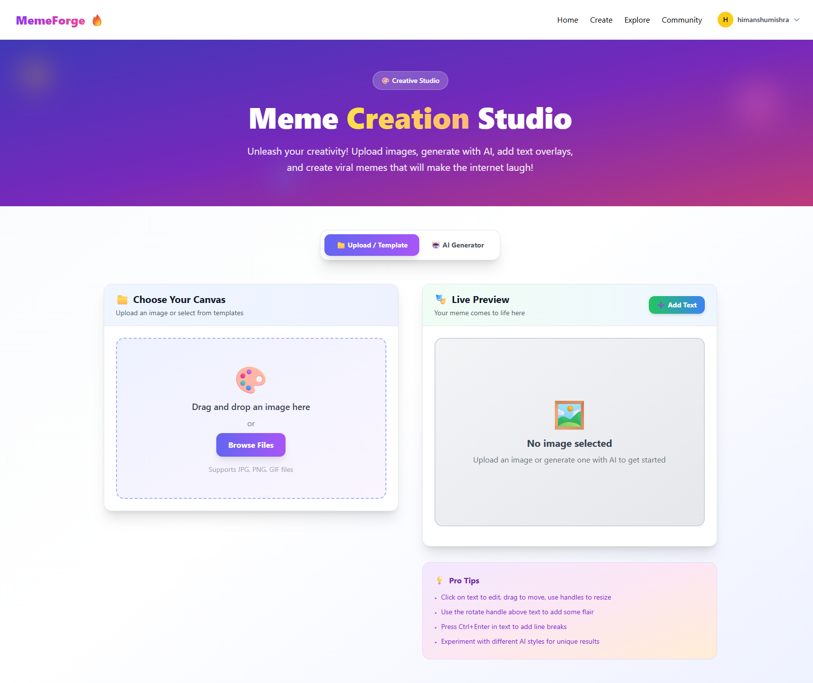
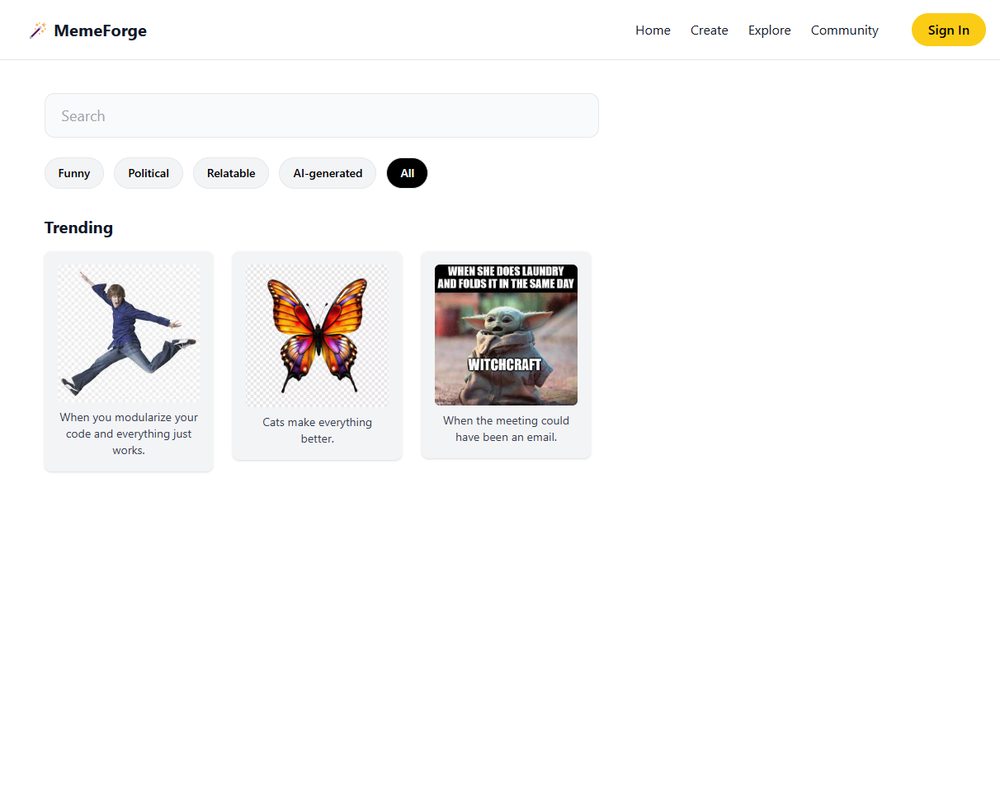

# MemeForge


## 🚀 Unleash Your Inner Meme Lord

MemeForge is a modern meme generator platform that lets you create, customize, and share hilarious memes with ease. Powered by AI and a vibrant community, MemeForge makes meme creation fun, fast, and social.

---

## ✨ Features
- **Text-to-Image AI**: Generate unique meme images from text prompts using advanced AI technology.
- **Trending Templates**: Browse a constantly updating library of popular meme templates.
- **Instant Sharing**: Share your memes directly to social media platforms with a single click.
- **Community Highlights**: See what others are creating and join the fun!
- **User Authentication**: Sign up, sign in, and manage your profile securely.
- **Password Recovery**: Forgot your password? Easily reset it via email.

---

## 🖼️ Screenshots

### Landing Page

*Welcome screen with trending memes and feature highlights.*

### Forgot Password

*Reset your password easily.*

### Sign Up

*Create a new account to join the community.*

### Sign In

*Secure login for returning users.*

### Meme Generator

*Create memes with templates, text, and customization options.*

### Explore Memes

*Browse trending and AI-generated memes by category.*

---

## 🛠️ Getting Started

### Prerequisites
- Node.js (v16+ recommended)
- npm or yarn
- MongoDB (for backend)

### Installation
1. **Clone the repository:**
   ```bash
   git clone https://github.com/yourusername/memeforge.git
   cd memeforge
   ```
2. **Install dependencies:**
   - Frontend:
     ```bash
     cd frontend
     npm install
     # or yarn install
     ```
   - Backend:
     ```bash
     cd backend
     npm install
     # or yarn install
     ```
3. **Set up environment variables:**
   - Copy `.env.example` to `.env` in both frontend and backend folders and fill in the required values.

4. **Run the app:**
   - Backend:
     ```bash
     cd backend
     npm run dev
     ```
   - Frontend:
     ```bash
     cd frontend
     npm run dev
     ```

5. **Open in browser:**
   Visit `http://localhost:3000` (or the port shown in your terminal).

---

## 🤝 Contributing
Pull requests are welcome! For major changes, please open an issue first to discuss what you would like to change.

---

## 📄 License
This project is licensed under the MIT License.

---

## 🙏 Credits
- MemeForge Team & Community
- [OpenAI](https://openai.com/) for AI inspiration

---

## 📬 Contact
For support or feedback, please open an issue or contact us at [your-email@example.com](mailto:your-email@example.com). 