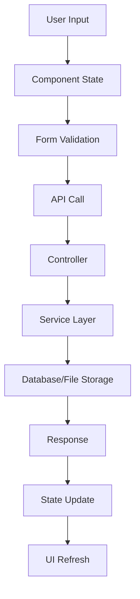
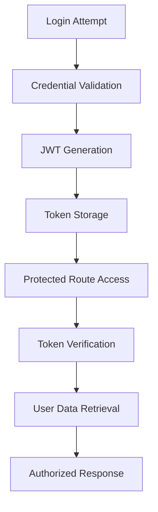

# MemeForge Complete Workflow Documentation

## Overview
MemeForge is a comprehensive meme generation platform that combines AI-powered image creation, community features, and administrative tools. This document outlines the complete user journey, system architecture, and operational workflows.

## 🏗 System Architecture

### High-Level Architecture
```
┌─────────────────┐    ┌─────────────────┐    ┌─────────────────┐
│   Frontend      │    │    Backend      │    │   External      │
│   (React)       │◄──►│   (Node.js)     │◄──►│   Services      │
│                 │    │                 │    │                 │
│ - User Interface│    │ - API Server    │    │ - OpenAI API    │
│ - State Mgmt    │    │ - Business Logic│    │ - MongoDB       │
│ - Routing       │    │ - File Storage  │    │ - SMTP Server   │
└─────────────────┘    └─────────────────┘    └─────────────────┘
```

### Technology Flow
```
User Input → React Components → Axios → Express Routes → Controllers → Services → Database/External APIs
         ← React State     ← JSON   ← Response      ← Business Logic ← Data Processing
```

## 👤 User Journey Workflows

### 1. New User Registration & Onboarding

#### Step 1: Landing Page Experience
- **Trigger**: User visits homepage (`/`)
- **Components**: `LandingPage.tsx`
- **Features Displayed**:
  - Hero section with value proposition
  - Feature highlights
  - User testimonials
  - Call-to-action buttons

#### Step 2: Account Creation
- **Trigger**: User clicks "Sign Up"
- **Route**: `/signup`
- **Process**:
  ```
  User Input → Form Validation → API Call → JWT Generation → Auto Login
  ```
- **Backend Flow**:
  ```typescript
  POST /api/auth/register
  ├── Input validation
  ├── Email uniqueness check
  ├── Password hashing (bcrypt)
  ├── User creation in MongoDB
  ├── JWT token generation
  └── Welcome email (optional)
  ```

#### Step 3: First-Time User Experience
- **Automatic Redirect**: User dashboard or meme generator
- **Tutorial Overlay**: Interactive guide for key features
- **Profile Setup Prompt**: Encourage bio and avatar upload

### 2. Meme Creation Workflow

#### Method A: Template-Based Creation

1. **Template Selection**
   - Route: `/create`
   - Options: Upload image or select from templates
   - File validation: Size, format, dimensions

2. **Text Customization**
   ```
   Template Selection → Text Input → Style Customization → Position Adjustment → Preview → Save
   ```
   - Add multiple text layers
   - Customize fonts, colors, sizes
   - Drag-and-drop positioning
   - Rotation controls

3. **Preview & Refinement**
   - Real-time preview with `MemeTextOverlay` component
   - Undo/redo functionality
   - Style adjustments

4. **Save Process**
   ```typescript
   Frontend Canvas → Image Generation → API Upload → Database Storage → URL Return
   ```

#### Method B: AI-Powered Creation

1. **Prompt Input**
   - User enters descriptive text
   - Style selection (realistic, anime, cartoon, etc.)
   - Model selection (DALL-E 2/3)

2. **AI Generation Pipeline**
   ```
   User Prompt → Style Enhancement → OpenAI API → Image Generation → Local Storage → Database Record
   ```

3. **Backend Processing**
   ```typescript
   POST /api/images/generate
   ├── Prompt enhancement based on style
   ├── OpenAI API call
   ├── Image download and local storage
   ├── Database record creation
   └── Return image URL to frontend
   ```

4. **Post-Generation Options**
   - Add text overlays to AI-generated image
   - Save as personal template
   - Share publicly

### 3. Community Interaction Workflow

#### Content Discovery
- **Route**: `/memes` (All Memes Page)
- **Features**:
  - Masonry grid layout
  - Infinite scroll or pagination
  - Search and filter capabilities
  - Sorting options (newest, popular, trending)

#### Social Features
1. **Like System**
   ```
   User Click → Authentication Check → API Call → Database Update → UI Update
   ```
   ```typescript
   POST /api/likes
   ├── User authentication
   ├── Duplicate check
   ├── Like record creation
   ├── Counter increment
   └── Real-time UI update
   ```

2. **Review System**
   - Rating (1-5 stars)
   - Text comments
   - Moderation capabilities
   - Nested replies (if implemented)

3. **Community Page**
   - Featured content
   - User spotlights
   - Trending discussions
   - Community guidelines

### 4. User Profile Management

#### Profile Customization
- **Route**: `/profile`
- **Features**:
  - Avatar upload and cropping
  - Bio editing
  - Privacy settings (public/private)
  - Social media links

#### Content Management
- **Personal Collections**:
  - Created memes gallery
  - Liked content
  - Draft memes
  - Template collections

- **Privacy Controls**:
  - Profile visibility settings
  - Content sharing preferences
  - Comment moderation

## 🔐 Authentication & Authorization Flow

### JWT Token Lifecycle
```
Login → Token Generation → Client Storage → Request Headers → Server Validation → Protected Access
```

### Role-Based Access Control
```typescript
interface UserPermissions {
  user: ['create_meme', 'like_content', 'comment'];
  admin: ['moderate_content', 'manage_templates', 'view_analytics'];
  super_admin: ['manage_users', 'system_admin', 'full_access'];
}
```

### Session Management
1. **Token Storage**: localStorage (frontend)
2. **Automatic Refresh**: Background token validation
3. **Secure Logout**: Token blacklisting and cleanup

## 🛠 Admin Management Workflow

### Admin Dashboard Access
- **Route**: `/admin`
- **Access Control**: Role-based authentication
- **Components**: Sidebar navigation, overview cards, management interfaces

### User Management Process (Super Admin)
```
User Selection → Profile View → Action Selection → Confirmation → Database Update → Audit Log
```

### Content Moderation Workflow
1. **Automated Screening**
   - Content analysis for inappropriate material
   - Spam detection algorithms
   - Community reporting system

2. **Manual Review Process**
   - Admin review queue
   - Approval/rejection workflow
   - Content editing capabilities

3. **Testimonial Management**
   ```
   User Submission → Pending Queue → Admin Review → Approval Decision → Public Display
   ```

## 📁 File Management System

### Upload Process
```
File Selection → Client Validation → Progress Tracking → Server Upload → Processing → Storage → Database Record
```

### Storage Structure
```
assets/
├── generated/          # AI-generated images by user
│   └── {userId}/
├── media/             # User uploads
├── memes/             # Final meme creations by user
│   └── {userId}/
└── testimonial-images/ # Testimonial attachments
```

### File Processing Pipeline
1. **Upload Validation**
   - File type checking
   - Size limit enforcement
   - Malware scanning (if implemented)

2. **Processing**
   - Image optimization
   - Thumbnail generation
   - Format conversion (if needed)

3. **Storage & CDN**
   - Local file system storage
   - Database metadata storage
   - CDN distribution (production)

## 🔄 Data Flow Patterns

### Create Meme Flow


### Authentication Flow


## 🔍 Search & Discovery System

### Search Implementation
- **Frontend**: Real-time search with debouncing
- **Backend**: MongoDB text indexing and aggregation
- **Features**: 
  - Fuzzy search capabilities
  - Tag-based filtering
  - User-based filtering
  - Date range filtering

### Recommendation Engine
1. **Content-Based Filtering**
   - Similar style memes
   - Same creator content
   - Tag-based recommendations

2. **Collaborative Filtering**
   - User behavior analysis
   - Like/view patterns
   - Community preferences

## 📊 Analytics & Monitoring

### User Analytics
- Page views and engagement
- Feature usage patterns
- Content creation metrics
- Community interaction data

### System Monitoring
- API response times
- Database query performance
- Error rates and types
- Resource utilization

### Business Intelligence
- User growth trends
- Content popularity metrics
- Feature adoption rates
- Revenue tracking (if applicable)

## 🚨 Error Handling & Recovery

### Client-Side Error Handling
```typescript
interface ErrorBoundary {
  componentDidCatch(error: Error, errorInfo: ErrorInfo): void;
  render(): ReactNode;
}
```

### Server-Side Error Management
```typescript
interface APIErrorResponse {
  success: false;
  error: {
    type: string;
    message: string;
    code?: string;
    details?: any;
  };
}
```

### Recovery Mechanisms
1. **Graceful Degradation**
   - Fallback UI components
   - Offline functionality
   - Cached content delivery

2. **Retry Logic**
   - Automatic API retry
   - Exponential backoff
   - Circuit breaker pattern

## 🔧 Performance Optimization

### Frontend Optimization
- **Code Splitting**: Route-based and component-based
- **Lazy Loading**: Images and non-critical components
- **Caching**: React Query for API responses
- **Bundle Optimization**: Tree shaking and minification

### Backend Optimization
- **Database Indexing**: Optimized queries
- **Caching**: Redis for session and query caching
- **File Compression**: Image optimization
- **CDN Integration**: Static asset delivery

## 🚀 Deployment Workflow

### Development Environment
```bash
# Frontend
npm run dev         # Start Vite dev server

# Backend
npm run dev         # Start nodemon with TypeScript
npm run seed        # Populate initial data
```

### Production Deployment
```bash
# Build Process
npm run build       # Frontend build
npm run start       # Backend production server

# Environment Setup
- Environment variables configuration
- Database connection optimization
- Static file serving setup
- SSL certificate configuration
```

### CI/CD Pipeline
1. **Code Push** → **Automated Testing** → **Build Process** → **Deployment**
2. **Database Migrations** → **Health Checks** → **Go Live**

## 🔒 Security Implementation

### Data Protection
- **Input Sanitization**: All user inputs
- **SQL Injection Prevention**: Parameterized queries
- **XSS Protection**: Content Security Policy
- **File Upload Security**: Type and size validation

### API Security
- **Rate Limiting**: Prevent abuse
- **CORS Configuration**: Cross-origin restrictions
- **Authentication**: JWT token validation
- **Authorization**: Role-based permissions

## 📱 Mobile Responsiveness

### Responsive Design
- **Breakpoint Strategy**: Mobile-first approach
- **Touch Interactions**: Optimized for mobile devices
- **Performance**: Lightweight mobile experience
- **Progressive Web App**: Offline capabilities

## 🔄 Backup & Recovery

### Data Backup Strategy
1. **Automated Database Backups**
   - Daily full backups
   - Incremental backups
   - Multi-location storage

2. **File System Backups**
   - User-generated content
   - System configuration files
   - Application assets

### Disaster Recovery
- **Recovery Time Objective (RTO)**: 4 hours
- **Recovery Point Objective (RPO)**: 1 hour
- **Failover Procedures**: Automated switching
- **Data Integrity Checks**: Post-recovery validation

This comprehensive workflow documentation provides a complete overview of how MemeForge operates from user interaction to system administration, ensuring all stakeholders understand the platform's functionality and architecture. 